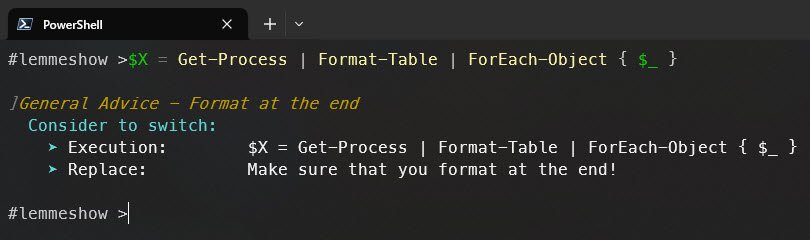

# PSClippy.FBP.GeneralAdvice

## The general advice FeedbackProvider, for general best practices: PSClippy - General Advice

### For getting advices to implement best practices, while scripting

#### How it works

- Install module 'PSClippy.FBP.GeneralAdvice'
- Install module [ScriptFeedbackProvider](https://github.com/JustinGrote/ScriptFeedbackProvider/tree/main) by Justin Grote
- Import module 'PSClippy.FBP.GeneralAdvice'
- Enable-ExperimentalFeature **PSFeedbackProvider**
- Start Scripting

#### Demo Time

#### Covered Topics

- Format on the right *Inspired by [Justin Grote](https://gist.github.com/JustinGrote/0bcb1a2960eae77aca2d6c5058b944b1)*
- Filter left *Inspired by [Adam Bertram](https://adamtheautomator.com/) by this [tweet](https://x.com/adbertram/status/1787078499058262160)*
- $Null comparison on the left *Inspired by [Daniel Schroeder](https://blog.danskingdom.com/about/) by his [TiPS](https://github.com/deadlydog/PowerShell.tiPS) module*

#### How to contribute

Found an edge case what my providers are missing?
Have a good idea a topic which is not covered? Feel free to create an issue and I will try to implement it as soon as possible.

#### Side Notes

This module came up based on a sessions I´ve seen at the PowerShell + Devops Global Summit in 2024.

[Justin Grote](https://github.com/JustinGrote) introduces in his session how FeedbackProvider in PowerShell works and he showed his ScriptFeedBackProvider Module.
